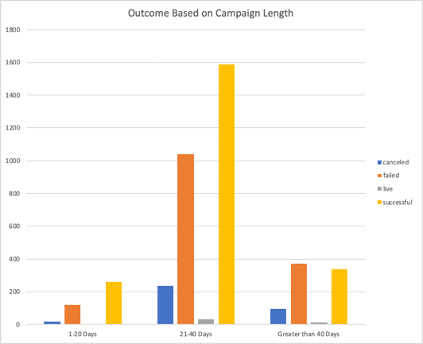
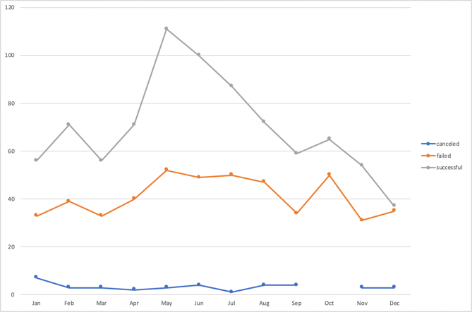
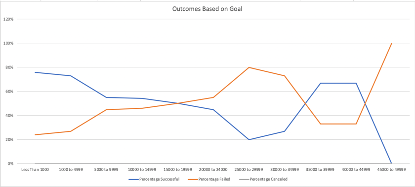

# An Analysis of Kickstarter Campaigns
Analysis of kickstarter campaigns to determine optimal fundraising potential. This repository includes deliverables in support of the project.

## Background
Louise’s play Fever came close came close to its fundraising goal in a short amount of time. How many other Kickstarter campaigns were able to do this as well? In this challenge, you’ll conduct a data analysis to answer this question and determine whether the length of a campaign contributes to its ultimate success or failure.

## Objectives

* Use filters and Excel formula to create new datasets
* Create visualizations using Excel charts and pivot tables
* Interpret the summary data provided from the visualizations

### Challenge
Analysis of the Kickstarter data shows successful campaigns in the plays subcategory regardless of the length of the campaign. However, the vast majority of successfull campaigns have a length between 21 and 40 days.

We also find the highest distribution of successfull campaigns in the summer between the months of May and July.

Goal amount is a significant factor in the success/failure of a campaign. We find the largest distribution of successfull campaigns in the plays subcategory range between $1,000 and $4,999 dollars.

